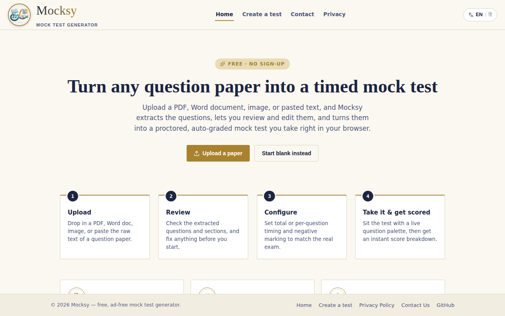

# Mocksy — Mock Test Generator

[](LICENSE)
[](https://mocksy-app.vercel.app)
[](mock-test-generator/package.json)
[](server/package.json)

Mocksy turns any question paper — a PDF, a Word doc, a photo of a printed sheet, or plain pasted text — into a timed, proctored, auto-graded mock test you can take right in your browser. It's built for students prepping for competitive exams (GATE, SSC, UPSC, banking, and similar) who want to practice under real exam conditions instead of just reading through a paper.

**Live app:** https://mocksy-app.vercel.app



## How it works

1. **Upload** — Drop in a PDF, `.docx`, an image of a printed paper, or paste the raw text of a question paper. You can also start from a blank test.
2. **Review** — Mocksy (via Google's Gemini API) extracts the questions and sections automatically. Nothing starts until you've reviewed and corrected the extraction, so mistakes never slip into your test.
3. **Configure** — Set total-test, per-section, or per-question timing, and negative marking (including GATE-style fractional marking) to match the real exam.
4. **Take it** — Sit the test with a live question palette, an optional in-test scientific calculator, and a locked, distraction-free layout.
5. **Get scored** — Get an instant score breakdown and results chart the moment you submit. The score summary is also saved locally so you can revisit it later from the Past Attempts page.

## Features

- **Any source format** — PDF, Word (`.docx`), a photo of a printed paper, or text pasted directly.
- **Editable extraction** — You always get to check and fix the extracted questions before the test begins.
- **Flexible timing** — Total-test, per-section, or per-question timers.
- **Negative marking** — Configurable per question type.
- **Optional calculator** — An in-test scientific calculator you can enable when the exam allows it.
- **Bilingual** — The entire site, including the upload flow, is available in Hindi and English.
- **Dark mode** — Follows your OS's light/dark setting by default; a toggle in the header lets you override it, remembered for next time.
- **Local test history** — Every completed test's score is saved automatically (per browser/device, capped at the most recent 30) and viewable on the Past Attempts page — no login required.
- **Installable PWA** — Installable as an app on desktop and mobile, with offline-friendly caching.
- **Downloadable results** — Export your test and score as a PDF via `jsPDF`.

## Tech stack

**Frontend** (`mock-test-generator/`)
- React 19 + React Router
- Tailwind CSS
- Recharts (results charts), jsPDF (PDF export), Mammoth (`.docx` parsing), PDF.js (PDF parsing)
- Configured as a PWA (service worker + install prompt)

**Backend** (`server/`)
- A minimal Node.js + Express proxy that keeps the Gemini API key secret and forwards question-extraction requests from the frontend to Google's Gemini API, with automatic model fallback and free-tier rate-limit handling.

## Project structure

```
Mock-Test-Generator/
├── mock-test-generator/   # React frontend (the app itself)
│   ├── src/
│   │   ├── components/    # Header, footer, layout, shared UI
│   │   ├── pages/         # Home, Privacy Policy, Contact Us, Past Attempts
│   │   ├── i18n/          # English/Hindi strings + light/dark theme context
│   │   ├── testHistory.js   # Local (localStorage) past-attempts store
│   │   └── MockTestApp.jsx  # Upload → Review → Configure → Take → Results flow
│   └── public/
└── server/                 # Express proxy for the Gemini API
    └── server.js
```

## Getting started locally

**Prerequisites:** Node.js 18+ (needed for native `fetch` used by the backend) and npm.

### 1. Frontend

```bash
cd mock-test-generator
npm install
npm start
```

Runs the app at [http://localhost:3000](http://localhost:3000).

### 2. Backend (Gemini proxy)

The question-extraction step calls Google's Gemini API through a small backend, so your API key never reaches the browser.

```bash
cd server
npm install
```

Create a `.env` file inside `server/`:

```
GEMINI_API_KEY=your_key_here
PORT=3001
```

Get a free key at [aistudio.google.com/apikey](https://aistudio.google.com/apikey) (no credit card needed), then run:

```bash
node server.js
```

### Available frontend scripts

Run these from inside `mock-test-generator/`:

- `npm start` — Runs the app in development mode.
- `npm test` — Launches the test runner in interactive watch mode.
- `npm run build` — Builds an optimized production bundle to `build/`.

## Deployment

The frontend is deployed on [Vercel](https://vercel.com); see `mock-test-generator/vercel.json` for routing and caching rules. Set `GEMINI_API_KEY` (and `ALLOWED_ORIGIN`, pointed at your deployed frontend URL) as environment variables wherever you host `server/`.

## Known limitations & troubleshooting

- **Extraction quality depends on input quality.** Blurry photos, dense multi-column layouts, or handwritten papers may extract poorly — always review the extracted questions before starting a test (see step 2 above).
- **Free-tier rate limits.** The backend proxies to Gemini's free tier and automatically falls back across a list of models (see `MODEL_FALLBACKS` in `server/server.js`) if one is overloaded or retired. If extraction stalls or fails outright, you may have hit the free-tier quota — wait a minute and retry, or use a paid Gemini key.
- **Model names can go stale.** Google renames/retires Gemini models fairly often. If extraction starts failing across the board, check [ai.google.dev/gemini-api/docs/models](https://ai.google.dev/gemini-api/docs/models) and update `MODEL_FALLBACKS` in `server/server.js`.
- **CORS in production.** If you deploy the backend and the frontend can't reach it, make sure `ALLOWED_ORIGIN` is set on the backend to your deployed frontend's exact URL.
- **Past Attempts history is per-browser, not per-device or account.** It's stored in `localStorage`, capped at the most recent 30 attempts (oldest auto-removed). A different browser, a different device, or clearing site data all start with an empty history — there's no sync, since there's no account system.

## Team

Built by:

- **Prateek Tripathi** — [GitHub](https://github.com/tprateek01) · [LinkedIn](https://www.linkedin.com/in/prateek-tripathi-3a100a252/)
- **Anmol Pandey** — [GitHub](https://github.com/AnmolPandey9119) · [LinkedIn](https://www.linkedin.com/in/anmol-pandey-240105376/)

## Contributing / feedback

Found a bug or have a feature idea? Open an issue on [GitHub Issues](https://github.com/tprateek01/Mock-Test-Generator/issues).

## License

Licensed under the [MIT License](LICENSE).